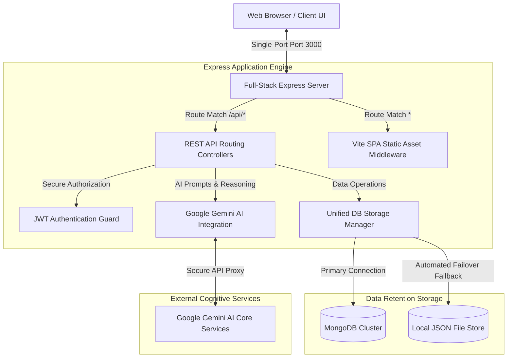
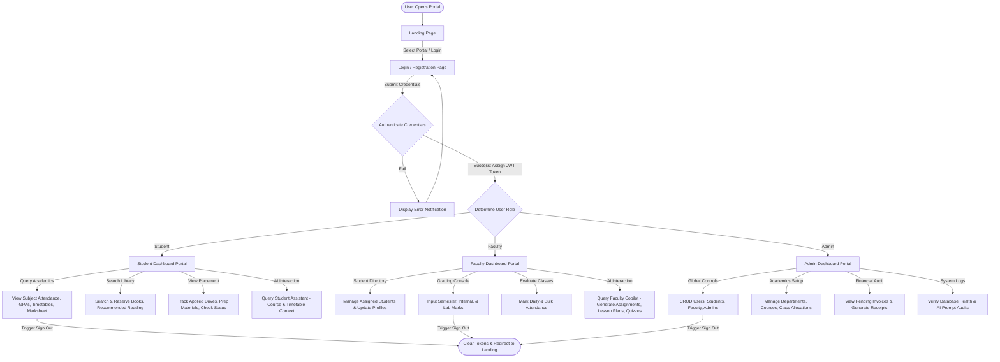
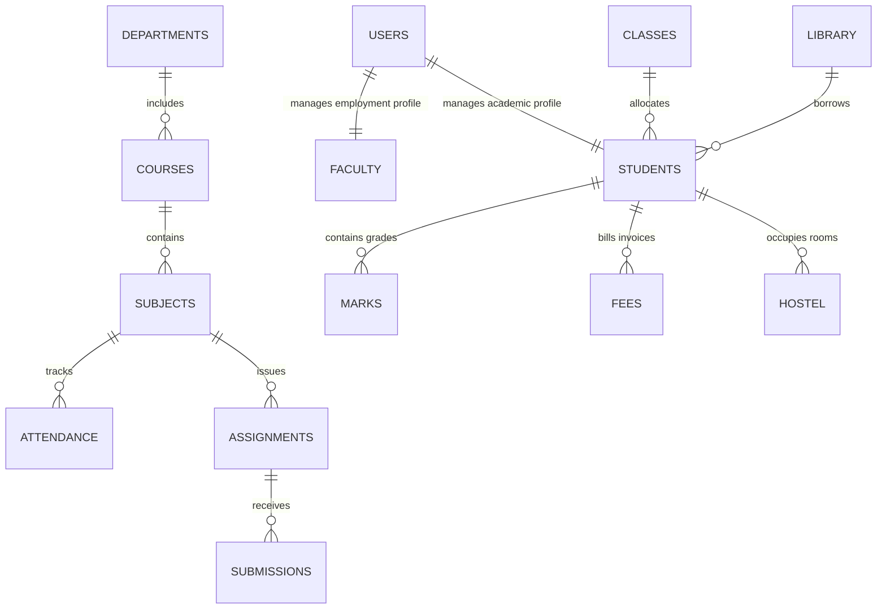

# CampusPilot AI — System Architecture & Design Specification

This document details the architectural guidelines, workflow engines, user use cases, and database entity relationships for the **CampusPilot AI** Smart Campus Management System.

---

## 🏗️ 1. System Architecture Diagram

CampusPilot AI utilizes a unified full-stack architecture that supports high-speed Hot Module Replacement in development and optimizes network latency inside production containers.

### High-Level Architecture Model



---

## 🔄 2. Interactive Flow Chart (User Lifecycle)

The flowchart below traces user access authentication, role identification, and role-specific dashboard workflows.



---

## 🎯 3. Use Case Diagram

The use case diagram outlines the system access boundaries and specific database actions available to each user class.

```mermaid
rect User Authorization Boundaries
    left to right direction
    
    actor "Student User" as Student
    actor "Faculty User" as Faculty
    actor "System Administrator" as Admin
    
    rectangle "CampusPilot AI Core System" {
        usecase "Authenticate Profile & Change Password" as UC1
        usecase "View Academic Records & Printable Marksheet" as UC2
        usecase "Query Library & Book Recommendations" as UC3
        usecase "Access Course AI Tutor" as UC4
        
        usecase "Update Student Assessment Scores" as UC5
        usecase "Conduct Batch Daily Attendance Audits" as UC6
        usecase "Publish Lesson Plans & Draft Class Quizzes via AI Copilot" as UC7
        
        usecase "Global User Provisioning (CRUD Students/Faculty)" as UC8
        usecase "Configure Global System Theme & SMTP Settings" as UC9
        usecase "Monitor Host Infrastructure & Audit System Usage Logs" as UC10
    }
    
    Student --> UC1
    Student --> UC2
    Student --> UC3
    Student --> UC4
    
    Faculty --> UC1
    Faculty --> UC5
    Faculty --> UC6
    Faculty --> UC7
    
    Admin --> UC1
    Admin --> UC8
    Admin --> UC9
    Admin --> UC10
end
```

---

## 🗄️ 4. Database Design / Entity-Relationship (ER) Schema

CampusPilot AI uses a fully integrated document-oriented MongoDB design with strict Mongoose type guards, alongside a JSON file database fallback to guarantee 100% service uptime.

### Entity Relationships Mapping



### Detailed Document Collections Properties

#### 1. `users` (Authentication & Base Profile Directory)
- `id` (String, Primary Key) - Unique login ID
- `name` (String) - Full User name
- `email` (String, Unique Index) - University email credentials
- `password` (String) - Hashed password string
- `role` (String) - `Student` | `Faculty` | `Admin`
- `department` (String) - Affiliated branch name
- `status` (String) - `Active` | `Inactive`
- `avatarUrl` (String) - Dicebear/Unsplash reference link
- `phone` / `dob` / `gender` / `address` / `emergencyContact` (String) - User meta records

#### 2. `students` (Official Academic Registry)
- `id` (String, Primary Key) - Reference ID (links to `users.id`)
- `name` / `email` / `avatarUrl` / `phone` / `dob` / `gender` / `address` (String) - Cached values
- `rollNo` (String, Unique Index) - Official university registration index
- `department` / `semester` / `section` / `batch` (String) - Cohort mappings
- `parentDetails` (Object) - `{ fatherName, motherName, contact }`
- `cgpa` (Number) - Active cumulative Grade Point Average
- `attendancePercentage` (Number) - Consolidated class attendance rate

#### 3. `faculty` (Employment Directory)
- `id` (String, Primary Key) - Reference ID (links to `users.id`)
- `name` / `email` / `avatarUrl` / `phone` (String) - Profile details
- `employeeId` (String, Unique Index) - Instructor identification index
- `designation` (String) - `Assistant Professor` | `Associate Professor` | `HOD`
- `department` (String) - Division name
- `subjectsAssigned` (Array of Strings) - List of subject codes taught
- `classesAssigned` (Array of Strings) - List of assigned semesters and sections

#### 4. `departments` (Institutional Divisions)
- `id` (String, Primary Key)
- `name` (String) - e.g., "Computer Science Engineering"
- `code` (String, Unique) - e.g., "CSE"
- `hod` (String) - Head of Department name
- `facultyCount` (Number) - Statistics tracking
- `studentCount` (Number) - Statistics tracking

#### 5. `subjects` (Academic Curriculum Inventory)
- `id` (String, Primary Key)
- `name` (String) - e.g., "Data Structures"
- `code` (String, Unique Index) - e.g., "CS-201"
- `department` (String) - Division alignment
- `credits` (Number) - Credit score value (e.g., `4`)
- `type` (String) - `Core` | `Elective` | `Lab`

#### 6. `classes` (Cohort Allocations)
- `id` (String, Primary Key)
- `name` (String) - Cohort label (e.g., "3rd Year CSE - Section A")
- `code` (String) - Reference tag (e.g., "CSE-3-A")
- `department` (String) - Associated branch
- `semester` / `section` / `batch` (String) - Year alignment
- `subjects` (Array of Strings) - Subject codes assigned to this cohort

#### 7. `attendance` (Daily Attendance Registers)
- `id` (String, Primary Key)
- `studentId` (String) - Foreign key
- `studentName` / `rollNo` (String) - Cached student details
- `courseId` / `courseName` (String) - Subject details
- `date` (String) - ISO formatted date string (`YYYY-MM-DD`)
- `status` (String) - `Present` | `Absent` | `Leave`
- `time` (String) - Mark timestamps

#### 8. `assignments` (Homework Task Inventory)
- `id` (String, Primary Key)
- `title` (String) - Homework heading
- `courseName` / `courseCode` (String) - Subject assignments
- `dueDate` (String) - Absolute deadline
- `totalMarks` (Number) - Grade ceiling value
- `submissionsCount` (Number) - Total submissions received
- `totalStudents` (Number) - Size of course roster
- `status` (String) - `Pending` | `Submitted` | `Evaluated`
- `pdfUrl` (String) - Attachment reference link

#### 9. `assignmentSubmissions` (Student Submissions Ledger)
- `id` (String, Primary Key)
- `assignmentId` (String) - Reference to parent `assignments.id`
- `studentId` / `studentName` / `rollNo` (String) - Student mapping
- `submittedFile` (String) - Document content payload (base64 or remote link)
- `submittedFileName` (String) - File name index
- `submissionDate` (String) - Mark timestamp
- `marksObtained` (Number) - Score evaluation grade
- `remarks` (String) - Instructor reviews
- `status` (String) - `Submitted` | `Graded`

#### 10. `internalMarks` & `semesterMarks` (Performance Grades Registers)
- `id` (String, Primary Key)
- `studentId` / `studentName` / `rollNo` (String) - Student mapping
- `courseId` / `courseName` (String) - Subject associations
- `examType` (String) - `Internal Assessment 1` | `Mid Semester` | `Lab Exam`
- `marksObtained` (Number) - Secured grading score
- `maxMarks` (Number) - Total grade ceiling (e.g., `50` or `100`)
- `grade` / `gpa` (String / Number) - Calculated equivalents

#### 11. `results` (Official Semester Results Registries)
- `id` (String, Primary Key)
- `studentId` / `studentName` / `rollNo` (String) - Identification keys
- `semester` (String) - Target semester label
- `sgpa` (Number) - Semester Grade Point Average
- `cgpa` (Number) - Cumulative Grade Point Average
- `published` (Boolean) - Visibility flag
- `subjects` (Array of Objects) - List of `{ code, name, grade, marks }`

#### 12. `notifications` (System Broadcasts)
- `id` (String, Primary Key)
- `title` / `message` (String) - Alerts message
- `timestamp` (String) - Broadcast date
- `category` (String) - `Academic` | `Admin` | `Events` | `Assignments` | `Placements` | `Library`
- `read` (Boolean) - Visibility flag
- `sender` (String) - Origin node (e.g., "Administrator")

#### 13. `documents` (Campus Repository Storage)
- `id` (String, Primary Key)
- `name` / `category` (String) - Document details
- `type` (String) - Access tier (`Student` | `Faculty`)
- `uploaderId` / `uploaderName` (String) - Author credentials
- `ownerId` (String, Optional) - Target user boundaries
- `size` / `uploadDate` (String) - Meta records
- `fileData` (String) - Content base64 buffer or link

#### 14. `placements` (Careers & Opportunities)
- `id` (String, Primary Key)
- `companyName` (String) - Recruiting firm
- `role` / `package` (String) - Job profile and compensation
- `location` / `eligibility` (String) - Placement filters
- `deadline` / `status` (String) - Drive details
- `applicantsCount` (Number) - Active registration count

#### 15. `hostel` (Residential Operations)
- `id` (String, Primary Key)
- `studentId` / `studentName` (String) - Occupant details
- `block` / `roomNo` / `roomType` (String) - Room coordinate details
- `wardenName` / `wardenContact` (String) - Contact registry
- `messType` (String) - `Veg` | `Non-Veg`
- `messMenu` (Object) - Day schedule: `{ breakfast, lunch, snacks, dinner }`

#### 16. `fees` (Financial Audit Ledgers)
- `id` (String, Primary Key)
- `studentId` (String) - Student mapping
- `term` (String) - Academic cycle description
- `academicFee` / `hostelFee` / `examFee` / `busFee` (Number) - Invoice itemization
- `paidAmount` (Number) - Remitted funds
- `status` (String) - `Paid` | `Unpaid` | `Partially Paid`
- `dueDate` (String) - Deadlines
- `transactions` (Array of Objects) - `{ id, amount, date, paymentMethod, referenceNo, status }`

#### 17. `library` (Textbook Catalogues)
- `id` (String, Primary Key)
- `title` / `author` / `category` / `isbn` (String) - Books description
- `available` (Boolean) - Availability index flag
- `dueDate` / `borrowedDate` (String) - Circulation details
